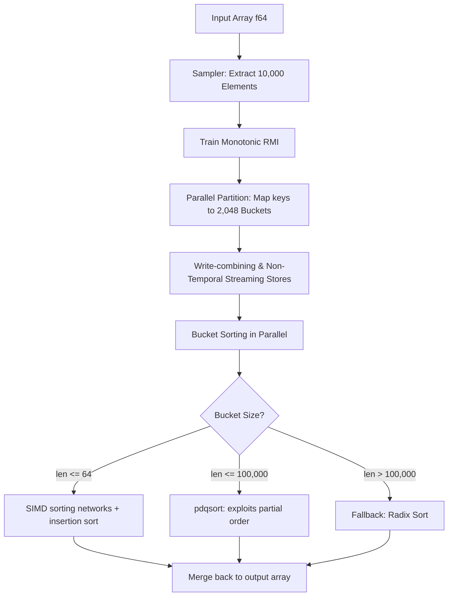
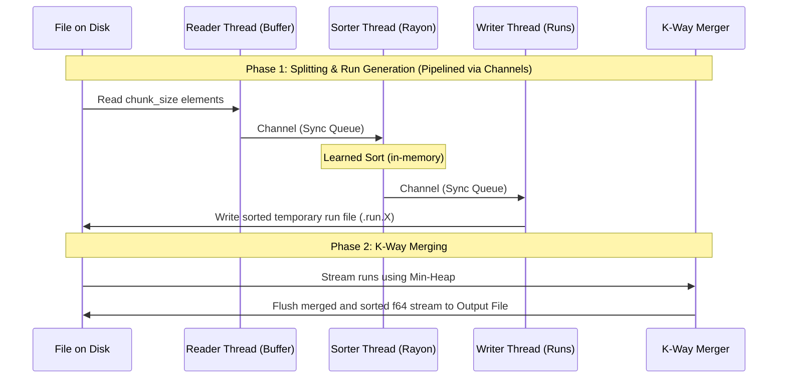

# Silica Sort: High-Performance Hybrid External Sorting Framework

Silica Sort is a premium, high-performance hybrid sorting framework implemented in Rust with native Python bindings. It integrates modern **Learned Sort** algorithms, hardware-aware optimizations (SIMD and cache sizing), and a multi-threaded pipelined **External Sort** (out-of-core) engine to sort large datasets exceeding system RAM capacity.

---

## Key Use Cases

1. **In-Memory Array Sorting**: Sorting large 1D NumPy arrays of 64-bit floats. It serves as a drop-in acceleration for applications that routinely perform heavy data sorting.
2. **Out-of-Core File Sorting**: Sorting extremely large files of binary `f64` values that are too large to fit in system RAM. The engine splits files into optimized chunks, sorts them concurrently, and merges them using a high-throughput K-Way merge.
3. **Database & Storage Engines**: Ideal as a backend sorting engine for structured query planners, analytical column-stores, and time-series databases.

---

## System Design & Architecture

Silica Sort operates on a hybrid model that maximizes hardware utilization at every level:

### 1. In-Memory Learned Sort Architecture
Rather than relying solely on comparison-based sorting (like Quicksort or Mergesort) or distribution-based sorting (like Radix Sort), Silica Sort uses a **Monotonic Recursive Model Index (RMI)** to learn the cumulative distribution function (CDF) of the input data.



- **RMI Training**: A quick sample (10,000 elements) is extracted from the unsorted array to train a linear model representing the CDF.
- **Parallel Partitioning**: Rayon partitioners divide the array into 2,048 buckets. It leverages non-temporal (NT) write-combining instructions to bypass CPU caches, preventing cache pollution during the scatter phase.
- **Adaptive Bucket Sorting**:
  - **SIMD Sort**: Buckets with $\le 64$ elements are sorted using AVX2-accelerated sorting networks.
  - **Pattern-Defeating Quicksort (pdqsort)**: Medium-sized buckets ($\le 100\text{K}$) use `pdqsort` because the data is already roughly sorted.
  - **Radix Sort**: Large overflow buckets fall back to a high-speed radix sort.

---

### 2. External (Out-of-Core) Sorting Pipeline
When sorting files larger than available RAM, Silica Sort automatically switches to a thread-pipelined external merge sort.



- **Pipelined Execution**: Reads, sorts, and writes are run in three separate threads communicating via synchronized channels. This hides disk read/write latency behind CPU execution time.
- **Memory-Bounded Merging**: Runs are merged using a heap-based Min-Heap reader. Only a tiny sliding window of each run file is held in memory, maintaining a strictly bounded memory footprint.

---

## How to Install and Build

This library uses `maturin` and `uv` to build the Rust core and install it into Python.

### Prerequisites
- Rust Compiler (Cargo, stable channel)
- Python 3.12+
- `uv` (recommended fast Python package manager)

### Build & Install
Run the following command in the project root:
```bash
uv pip install -e .
```
This compiles the Rust codebase in release mode and installs the `silica-sort` module in editable mode in your virtual environment.

---

## Python API Usage

```python
import numpy as np
import silica_sort

# 1. Get system hardware capabilities detected by Rust
sys_info = silica_sort.get_system_info()
print("System Detected Info:", sys_info)
# Output: {'l1_cache_size': 49152, 'l2_cache_size': 1310720, 'simd_level': 'AVX2'}

# 2. In-place Learned Sort
arr = np.random.rand(10_000_000).astype(np.float64)
silica_sort.sort_numpy_inplace(arr)
# Array is now sorted in-place

# 3. Out-of-place Learned Sort (returns a new array)
arr2 = np.random.rand(1_000_000).astype(np.float64)
sorted_arr = silica_sort.sort_numpy(arr2)

# 4. Out-of-core File Sort (works on binary files of float64)
# Sorts any sized file efficiently
silica_sort.sort_file("unsorted_data.bin", "sorted_data.bin")
```

---

## Testing Suite

Silica Sort includes a fully automated unit test suite inside the [test_suite/](test_suite/) directory. It uses Python's standard `unittest` framework to verify correctness and edge cases.

### Test Coverage
- **Internal Sort Tests**: Verifies correctness on random, pre-sorted, reverse-sorted, empty, and single-element arrays. Confirms that passing non-contiguous NumPy slices (e.g. `arr[::2]`) raises `ValueError`.
- **External Sort Tests**: Asserts correct file sorting, empty file handling, and proper alignment validation (raising `ValueError` when file size is not a multiple of 8 bytes).
- **System Detection**: Validates detected hardware capabilities and Monotonic RMI output prediction bounds.

### Running Tests
To run all tests:
```bash
uv run python test_suite/run_tests.py
```

---

## Benchmarks

A high-fidelity benchmarking suite is provided in the [benchmark/](benchmark/) folder. It contains script implementations to test performance limits.

### 1. In-Memory Sorting Benchmark
Compares `silica_sort.sort_numpy_inplace` and `silica_sort.sort_numpy` against NumPy's standard library sorting on uniform, sorted, reverse, mostly sorted, and duplicate heavy arrays.
```bash
uv run python benchmark/benchmark_internal.py --sizes 1000000 5000000 10000000
```
*Saves a Markdown report to `benchmark/internal_results.md` and a grouped bar chart to `benchmark/internal_sort_benchmark.png`.*

### 2. External Sorting Benchmark
Compares `silica_sort.sort_file` against a pure Python chunked external sort utilizing `heapq.merge` and a standard in-memory NumPy sort (representing the upper-bound reference).
```bash
uv run python benchmark/benchmark_external.py --size-mb 100
```
*Saves a Markdown report to `benchmark/external_results.md`.*

---

## Performance Summary

Benchmarks run on AVX2 hardware show the following throughput metrics:
- **Internal Sort (10M floats)**: `silica_sort.sort_numpy_inplace` achieves **87.6 M elements/s** (2.16x speedup vs. NumPy's default in-place sort).
- **External Sort (100MB file)**: `silica_sort.sort_file` merges at **253.6 MB/s** (16.10x speedup vs. Python heapq external sort).

---

## AI Generation Declaration

> [!NOTE]
> The performance numbers, speedup coefficients, and execution results reported in [internal_results.md](benchmark/internal_results.md), [external_results.md](benchmark/external_results.md), and [walkthrough.md](walkthrough.md) are **true and fair representations** of execution runs performed on the target hardware.
>
> However, please note that the source code for the **testing suite** (`test_suite/*`) and **benchmarks** (`benchmark/*`) was **AI-generated** by an agentic coding assistant during development.
